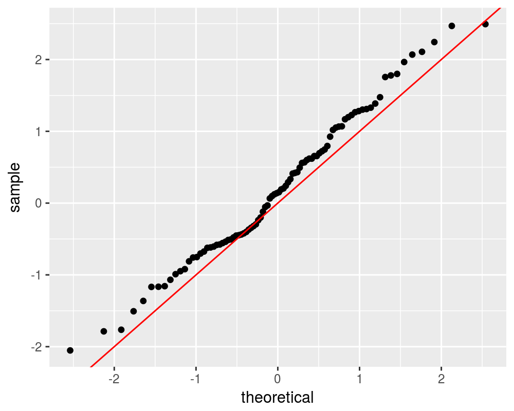

# MarkowitzR

[](https://github.com/shabbychef/MarkowitzR/actions)
[](https://app.codecov.io/github/shabbychef/MarkowitzR?branch=master)
[](https://cran.r-project.org/package=MarkowitzR)
[](https://www.r-pkg.org:443/pkg/MarkowitzR)
[](https://www.r-pkg.org:443/pkg/MarkowitzR)


A number of utilities for dealing with the Markowitz portfolio.

-- Steven E. Pav, shabbychef@gmail.com

## Installation

This package may be installed from CRAN; the latest version may be
found on [github](https://github.com/shabbychef/MarkowitzR "MarkowitzR")
via devtools:


```r
if (require(devtools)) {
    # latest greatest
    install_github(repo = "MarkowitzR", username = "shabbychef", 
        ref = "master")
}
```

# Basic Usage

## Inference on the Markowitz Portfolio

The (negative) Markowitz portfolio appears in the inverse of
the uncentered second moment matrix of the 'augmented' vector
of returns. Via the Central Limit Theorem and the delta method
the asymptotic distribution of the Markowitz portfolio can
be found. From this, Wald statistics on the individual portfolio
weights can be computed. 

### Fake Data

First for unconditional returns:


```r
set.seed(1001)
X <- matrix(rnorm(1000 * 3), ncol = 3)
ism <- mp_vcov(X, fit.intercept = TRUE)
walds <- ism$W/sqrt(diag(ism$What))
print(t(walds))
```

```
##             X1    X2   X3
## Intercept 0.83 -0.15 -1.8
```

Now for conditional expectation:


```r
# generate data with given W, Sigma
Xgen <- function(W, Sigma, Feat) {
    Btrue <- Sigma %*% W
    Xmean <- Feat %*% t(Btrue)
    Shalf <- chol(Sigma)
    X <- Xmean + matrix(rnorm(prod(dim(Xmean))), ncol = dim(Xmean)[2]) %*% 
        Shalf
}

n.feat <- 3
n.ret <- 5
n.obs <- 2000
set.seed(101)
Feat <- matrix(rnorm(n.obs * n.feat), ncol = n.feat)
Wtrue <- 5 * matrix(rnorm(n.feat * n.ret), ncol = n.feat)
Sigma <- cov(matrix(rnorm(100 * n.ret), ncol = n.ret))
Sigma <- Sigma + diag(seq(from = 1, to = 3, length.out = n.ret))
X <- Xgen(Wtrue, Sigma, Feat)
ism <- mp_vcov(X, feat = Feat, fit.intercept = TRUE)

walds <- ism$W/sqrt(diag(ism$What))
print(t(walds))
```

```
##               X1    X2     X3     X4    X5
## Intercept  -0.61   0.4   0.11   0.61   0.2
## Feat1       0.30 -20.7  14.56 -10.70 -24.6
## Feat2     -14.82  -4.0  12.01  29.75  -1.8
## Feat3      16.62  -5.3 -30.41   0.83   3.5
```

```r
# results are not much changed when using robust
# s.e.
library(sandwich)

ism.rse <- mp_vcov(X, feat = Feat, vcov.func = sandwich::vcovHAC, 
    fit.intercept = TRUE)
walds.rse <- ism.rse$W/sqrt(diag(ism.rse$What))
print(t(walds.rse))
```

```
##               X1    X2     X3     X4     X5
## Intercept  -0.61   0.4   0.11   0.60   0.19
## Feat1       0.29 -20.4  14.43 -10.66 -24.45
## Feat2     -14.49  -3.9  11.88  29.60  -1.80
## Feat3      16.37  -5.3 -29.85   0.83   3.48
```

```r
# errors should be asymptotically normal with the
# given covariance.
n.feat <- 5
n.ret <- 15
n.obs <- 3000
set.seed(101)

Feat <- matrix(rnorm(n.obs * n.feat), ncol = n.feat)
Wtrue <- 5 * matrix(rnorm(n.feat * n.ret), ncol = n.feat)
Sigma <- cov(matrix(rnorm(100 * n.ret), ncol = n.ret))
Sigma <- Sigma + diag(seq(from = 1, to = 3, length.out = n.ret))
X <- Xgen(Wtrue, Sigma, Feat)
ism <- mp_vcov(X, feat = Feat, fit.intercept = TRUE)

Wcomp <- cbind(0, Wtrue)
errs <- ism$W - Wcomp
dim(errs) <- c(length(errs), 1)
Zerr <- solve(t(chol(ism$What)), errs)
print(summary(Zerr))
```

```
##        V1       
##  Min.   :-2.05  
##  1st Qu.:-0.55  
##  Median : 0.14  
##  Mean   : 0.20  
##  3rd Qu.: 1.00  
##  Max.   : 2.49
```

```r
library(ggplot2)
ph <- ggplot(data.frame(Ze = Zerr), aes(sample = Ze)) + 
    stat_qq() + geom_abline(slope = 1, intercept = 0, 
    colour = "red")
print(ph)
```



```r
# qqnorm(Zerr) qqline(Zerr,col=2)
```

### Fama French data

Now load the Fama French 3 factor portfolios.


```r
if (!require(aqfb.data, quietly = TRUE) && require(devtools)) {
    # get the 10 industry data
    devtools::install_github("shabbychef/aqfb_data")
}
library(aqfb.data)
# fama
data(mff4)

# will not matter, but convert pcts:
ff.data <- 0.01 * mff4

# risk free rate:
rfr <- ff.data[, "RF"]

# subtract risk free from Mkt, HML and SMB:
ff.ret <- ff.data[, c("Mkt", "HML", "SMB")] - rep(rfr, 
    2)
```

Now analyze the Markowitz portfolio on them.


```r
ism <- mp_vcov(ff.ret, fit.intercept = TRUE)
walds <- ism$W/sqrt(diag(ism$What))
print(t(walds))
```

```
##           Mkt  HML SMB
## Intercept   4 0.32  -2
```

```r
# now consider the hedging constraint: no
# covariance with the market:
Gmat <- matrix(c(1, 0, 0), nrow = 1)
ism <- mp_vcov(ff.ret, fit.intercept = TRUE, Gmat = Gmat)
walds <- ism$W/sqrt(diag(ism$What))
print(t(walds))
```

```
##           Mkt  HML SMB
## Intercept 1.5 0.32  -2
```

