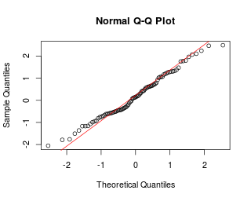

# MarkowitzR

[](https://travis-ci.org/shabbychef/MarkowitzR)
[](http://codecov.io/github/shabbychef/MarkowitzR?branch=master)


A number of utilities for dealing with the Markowitz portfolio.

-- Steven E. Pav, shabbychef@gmail.com

## Installation

This package may be installed from CRAN; the latest version may be
found on [github](https://www.github.com/shabbychef/MarkowitzR "MarkowitzR")
via devtools:


```r
if (require(devtools)) {
    # latest greatest
    install_github(repo = "MarkowitzR", username = "shabbychef", 
        ref = "master")
}
```

# Basic Usage

## Inference on the Markowitz Portfolio

The (negative) Markowitz portfolio appears in the inverse of
the uncentered second moment matrix of the 'augmented' vector
of returns. Via the Central Limit Theorem and the delta method
the asymptotic distribution of the Markowitz portfolio can
be found. From this, Wald statistics on the individual portfolio
weights can be computed. 

### Fake Data

First for unconditional returns:


```r
set.seed(1001)
X <- matrix(rnorm(1000 * 3), ncol = 3)
ism <- mp_vcov(X, fit.intercept = TRUE)
walds <- ism$W/sqrt(diag(ism$What))
print(t(walds))
```

```
##             X1    X2   X3
## Intercept 0.83 -0.15 -1.8
```

Now for conditional expectation:


```r
# generate data with given W, Sigma
Xgen <- function(W, Sigma, Feat) {
    Btrue <- Sigma %*% W
    Xmean <- Feat %*% t(Btrue)
    Shalf <- chol(Sigma)
    X <- Xmean + matrix(rnorm(prod(dim(Xmean))), ncol = dim(Xmean)[2]) %*% 
        Shalf
}

n.feat <- 3
n.ret <- 5
n.obs <- 2000
set.seed(101)
Feat <- matrix(rnorm(n.obs * n.feat), ncol = n.feat)
Wtrue <- 5 * matrix(rnorm(n.feat * n.ret), ncol = n.feat)
Sigma <- cov(matrix(rnorm(100 * n.ret), ncol = n.ret))
Sigma <- Sigma + diag(seq(from = 1, to = 3, length.out = n.ret))
X <- Xgen(Wtrue, Sigma, Feat)
ism <- mp_vcov(X, feat = Feat, fit.intercept = TRUE)

walds <- ism$W/sqrt(diag(ism$What))
print(t(walds))
```

```
##               X1    X2     X3     X4    X5
## Intercept  -0.61   0.4   0.11   0.61   0.2
## Feat1       0.30 -20.7  14.56 -10.70 -24.6
## Feat2     -14.82  -4.0  12.01  29.75  -1.8
## Feat3      16.62  -5.3 -30.41   0.83   3.5
```

```r
# results are not much changed when using robust
# s.e.
require(sandwich)

ism.rse <- mp_vcov(X, feat = Feat, vcov.func = sandwich::vcovHAC, 
    fit.intercept = TRUE)
walds.rse <- ism.rse$W/sqrt(diag(ism.rse$What))
print(t(walds.rse))
```

```
##               X1    X2     X3     X4     X5
## Intercept  -0.61   0.4   0.11   0.60   0.19
## Feat1       0.29 -20.4  14.43 -10.66 -24.45
## Feat2     -14.49  -3.9  11.88  29.60  -1.80
## Feat3      16.37  -5.3 -29.85   0.83   3.48
```

```r
# errors should be asymptotically normal with the
# given covariance.
n.feat <- 5
n.ret <- 15
n.obs <- 3000
set.seed(101)

Feat <- matrix(rnorm(n.obs * n.feat), ncol = n.feat)
Wtrue <- 5 * matrix(rnorm(n.feat * n.ret), ncol = n.feat)
Sigma <- cov(matrix(rnorm(100 * n.ret), ncol = n.ret))
Sigma <- Sigma + diag(seq(from = 1, to = 3, length.out = n.ret))
X <- Xgen(Wtrue, Sigma, Feat)
ism <- mp_vcov(X, feat = Feat, fit.intercept = TRUE)

Wcomp <- cbind(0, Wtrue)
errs <- ism$W - Wcomp
dim(errs) <- c(length(errs), 1)
Zerr <- solve(t(chol(ism$What)), errs)
print(summary(Zerr))
```

```
##        V1       
##  Min.   :-2.05  
##  1st Qu.:-0.55  
##  Median : 0.14  
##  Mean   : 0.20  
##  3rd Qu.: 1.00  
##  Max.   : 2.49
```

```r
qqnorm(Zerr)
qqline(Zerr, col = 2)
```

 

### Fama French data

Now load the Fama French 3 factor portfolios.


```r
ff.data <- read.csv(paste0("http://www.quandl.com/api/v1/datasets/", 
    "KFRENCH/FACTORS_M.csv?&trim_start=1926-07-31&trim_end=2013-10-31", 
    "&sort_order=asc"), colClasses = c(Month = "Date"))
```

```
## Error in file(file, "rt"): cannot open the connection
```

```r
rownames(ff.data) <- ff.data$Month
```

```
## Error in eval(expr, envir, enclos): object 'ff.data' not found
```

```r
ff.data <- ff.data[, !(colnames(ff.data) %in% c("Month"))]
```

```
## Error in eval(expr, envir, enclos): object 'ff.data' not found
```

```r
# will not matter, but convert pcts:
ff.data <- 0.01 * ff.data
```

```
## Error in eval(expr, envir, enclos): object 'ff.data' not found
```

```r
rfr <- ff.data[, "RF"]
```

```
## Error in eval(expr, envir, enclos): object 'ff.data' not found
```

```r
ff.ret <- cbind(ff.data[, "Mkt.RF"], ff.data[, c("HML", 
    "SMB")] - rep(rfr, 2))
```

```
## Error in cbind(ff.data[, "Mkt.RF"], ff.data[, c("HML", "SMB")] - rep(rfr, : object 'ff.data' not found
```

```r
colnames(ff.ret)[1] <- "MKT"
```

```
## Error in colnames(ff.ret)[1] <- "MKT": object 'ff.ret' not found
```

Now analyze the Markowitz portfolio on them.


```r
ism <- mp_vcov(ff.ret, fit.intercept = TRUE)
```

```
## Error in is.data.frame(x): object 'ff.ret' not found
```

```r
walds <- ism$W/sqrt(diag(ism$What))
print(t(walds))
```

```
##             X1    X2     X3     X4    X5    X6      X7    X8
## Intercept -1.2  -0.6   0.97   0.23   1.3   1.3  -0.013  0.25
## Feat1     -3.5  10.6 -13.34   7.37  21.8  -6.8 -19.378  4.56
## Feat2      5.3   1.4   0.40  11.63 -16.4  -2.0  -3.579  5.90
## Feat3     -7.4   2.7  10.32  -6.84   8.5   7.8  10.760 21.87
## Feat4      6.0  -6.5 -16.10 -26.24  -9.6   3.2  -5.797 25.10
## Feat5     -7.0 -13.0   4.77 -19.08   9.2 -14.7  -5.520 -3.19
##               X9   X10    X11    X12   X13   X14    X15
## Intercept   0.66  -1.4  -1.30   0.38   2.5  0.17   0.14
## Feat1       8.21  27.7   6.12  -7.14  -3.4 -2.69  20.13
## Feat2     -16.96 -24.4 -14.66 -20.66 -13.5 18.66  -7.49
## Feat3     -25.38 -13.4  -0.86   3.04   9.7  9.32 -24.31
## Feat4      -0.62  17.6  13.21  -9.49 -14.8  7.27  -4.44
## Feat5      25.94  18.7   0.12 -15.91   5.1  6.10  21.83
```

```r
# now consider the hedging constraint: no
# covariance with the market:
Gmat <- matrix(c(1, 0, 0), nrow = 1)
ism <- mp_vcov(ff.ret, fit.intercept = TRUE, Gmat = Gmat)
```

```
## Error in is.data.frame(x): object 'ff.ret' not found
```

```r
walds <- ism$W/sqrt(diag(ism$What))
print(t(walds))
```

```
##             X1    X2     X3     X4    X5    X6      X7    X8
## Intercept -1.2  -0.6   0.97   0.23   1.3   1.3  -0.013  0.25
## Feat1     -3.5  10.6 -13.34   7.37  21.8  -6.8 -19.378  4.56
## Feat2      5.3   1.4   0.40  11.63 -16.4  -2.0  -3.579  5.90
## Feat3     -7.4   2.7  10.32  -6.84   8.5   7.8  10.760 21.87
## Feat4      6.0  -6.5 -16.10 -26.24  -9.6   3.2  -5.797 25.10
## Feat5     -7.0 -13.0   4.77 -19.08   9.2 -14.7  -5.520 -3.19
##               X9   X10    X11    X12   X13   X14    X15
## Intercept   0.66  -1.4  -1.30   0.38   2.5  0.17   0.14
## Feat1       8.21  27.7   6.12  -7.14  -3.4 -2.69  20.13
## Feat2     -16.96 -24.4 -14.66 -20.66 -13.5 18.66  -7.49
## Feat3     -25.38 -13.4  -0.86   3.04   9.7  9.32 -24.31
## Feat4      -0.62  17.6  13.21  -9.49 -14.8  7.27  -4.44
## Feat5      25.94  18.7   0.12 -15.91   5.1  6.10  21.83
```

